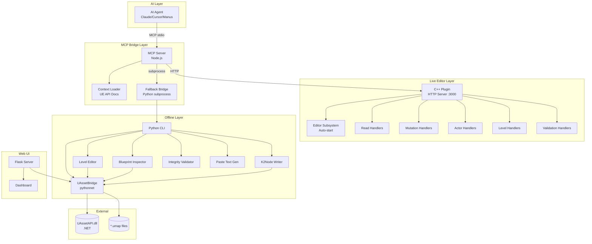
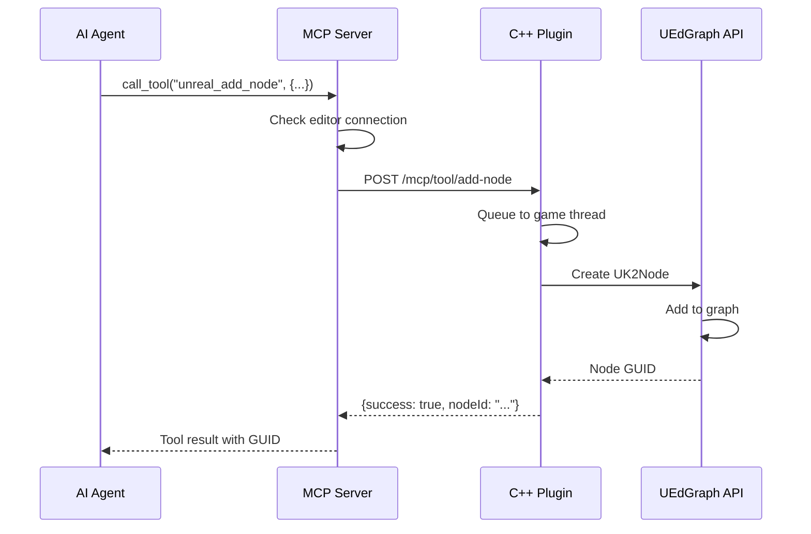
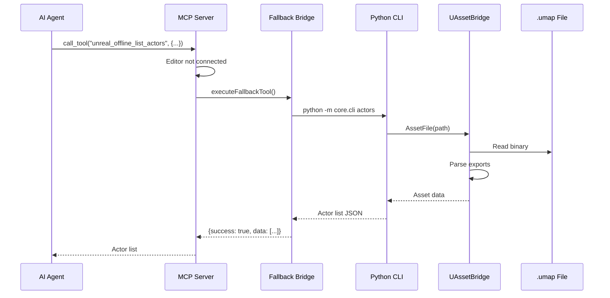
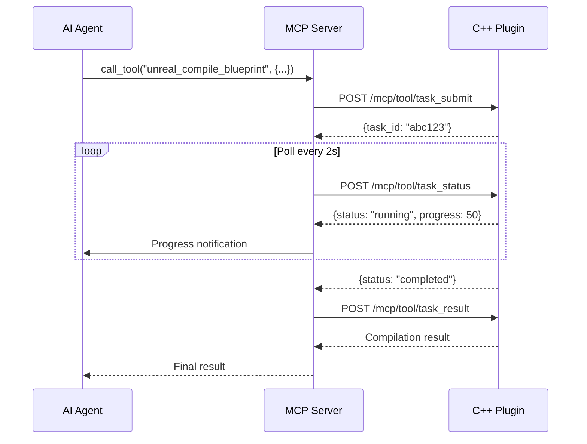
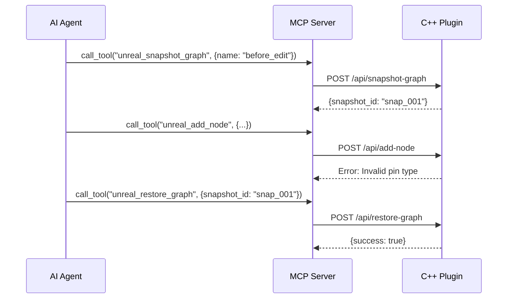
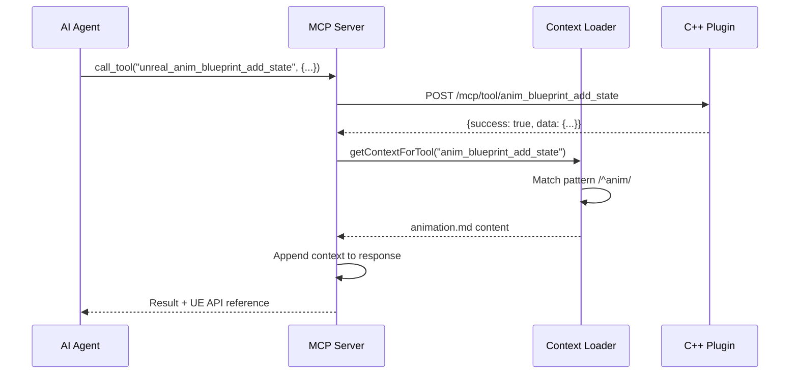
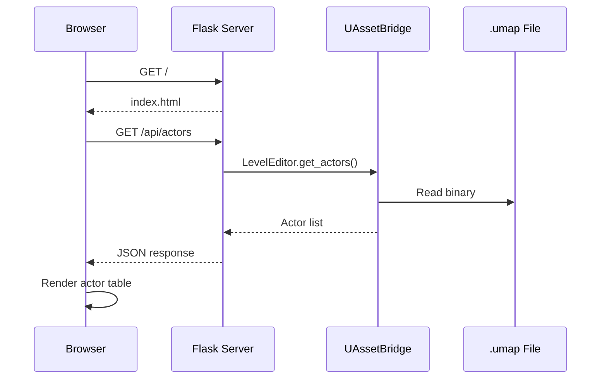

# AgenticMCP Server - Onboarding Documentation

> Comprehensive developer onboarding guide for the AgenticMCP dual-path MCP server for Unreal Engine 5.

---

## 1. Overview

### Purpose

AgenticMCP is an autonomous toolchain that enables AI agents (Claude, Cursor, Manus, etc.) to inspect, validate, and edit Unreal Engine 5 projects programmatically. It provides **two independent execution paths**:

1. **Live Editor Path**: C++ plugin running inside UE5, exposing the full UEdGraph API over HTTP for real-time Blueprint manipulation, compilation, and validation.
2. **Offline Fallback Path**: Python binary injector that reads/modifies `.umap` files directly when the editor is closed, using UAssetAPI.

This dual-path architecture is unique in the ecosystem—no other tool provides both live and offline manipulation.

### Key Features

- **Blueprint Manipulation**: Add nodes, connect pins, create graphs, compile Blueprints
- **Actor Management**: Spawn, delete, move actors; set properties and transforms
- **Level Editing**: Load/unload sublevels, edit level scripts, manage actor lists
- **Snapshot/Rollback**: Save graph state before destructive operations, restore if needed
- **Validation**: Pre-compilation error checking with detailed diagnostics
- **Auto-Discovery**: MCP bridge dynamically discovers tools from the C++ plugin
- **Context Injection**: Optionally injects UE5 API documentation into tool responses
- **Offline Fallback**: Full .umap parsing when editor is closed
- **Web Dashboard**: Read-only visualization for humans

### Technologies

| Layer | Technology |
|-------|------------|
| AI Interface | Model Context Protocol (MCP) via stdio |
| MCP Bridge | Node.js 18+, `@modelcontextprotocol/sdk` |
| Live Editor | C++ UE5 Plugin (Editor-only), HTTP server on port 3000 |
| Offline Injector | Python 3.11+, UAssetAPI (.NET via pythonnet) |
| Web Dashboard | Flask, vanilla HTML/JS |
| Asset Parsing | UAssetAPI (C# .NET) |

---

## 2. High-Level Architecture Diagram



### Component Summary

| Component | Description |
|-----------|-------------|
| **AI Agent** | External AI (Claude, Cursor, Manus) that sends MCP commands |
| **MCP Server** | Node.js server handling MCP protocol, routing tools to appropriate path |
| **Context Loader** | Loads UE5 API documentation for injection into responses |
| **Fallback Bridge** | Routes offline tools to Python subprocess |
| **C++ Plugin** | UE5 editor plugin exposing HTTP API for live manipulation |
| **Python CLI** | Command-line interface for offline asset operations |
| **UAssetBridge** | Core Python-to-.NET bridge for UAssetAPI |
| **Level Editor** | High-level .umap manipulation API |
| **Blueprint Inspector** | Kismet bytecode parsing and graph extraction |
| **K2Node Writer** | Binary K2Node construction and paste text generation |
| **Integrity Validator** | Reference integrity checking before saves |
| **Flask Server** | Web dashboard for visualization |

---

## 3. Component Breakdown

### Component: MCP Server (Node.js)

**File**: [index.js](agentic-mcp-server/AgenticMCP/Tools/index.js)

**Purpose**: Main entry point for the MCP server. Handles tool registration, request routing, and path selection (live vs. offline).

**Key Elements**:
- [`server`](agentic-mcp-server/AgenticMCP/Tools/index.js#L91) - MCP Server instance
- [`ListToolsRequestSchema handler`](agentic-mcp-server/AgenticMCP/Tools/index.js#L102) - Auto-discovers and registers tools
- [`CallToolRequestSchema handler`](agentic-mcp-server/AgenticMCP/Tools/index.js#L197) - Routes tool execution
- [`executeLiveTool()`](agentic-mcp-server/AgenticMCP/Tools/index.js#L263) - Executes via live editor with async support
- [`handleStatusRequest()`](agentic-mcp-server/AgenticMCP/Tools/index.js#L361) - Reports connection status

**Depends On**:
- Internal: `lib.js`, `context-loader.js`, `fallback.js`
- External: `@modelcontextprotocol/sdk`

---

### Component: HTTP Library

**File**: [lib.js](agentic-mcp-server/AgenticMCP/Tools/lib.js)

**Purpose**: HTTP client utilities for communicating with the UE5 C++ plugin. Handles timeouts, async task queue, and schema conversion.

**Key Elements**:
- [`fetchWithTimeout()`](agentic-mcp-server/AgenticMCP/Tools/lib.js#L24) - Fetch with AbortController timeout
- [`fetchUnrealTools()`](agentic-mcp-server/AgenticMCP/Tools/lib.js#L44) - Fetches tool list from plugin
- [`executeUnrealTool()`](agentic-mcp-server/AgenticMCP/Tools/lib.js#L69) - Synchronous tool execution
- [`executeUnrealToolAsync()`](agentic-mcp-server/AgenticMCP/Tools/lib.js#L170) - Async task queue execution
- [`convertToMCPSchema()`](agentic-mcp-server/AgenticMCP/Tools/lib.js#L118) - Converts Unreal schema to MCP

**Depends On**:
- External: Node.js `fetch` API

---

### Component: Context Loader

**File**: [context-loader.js](agentic-mcp-server/AgenticMCP/Tools/context-loader.js)

**Purpose**: Loads and injects UE5 API documentation into tool responses. Supports category-based and query-based context retrieval.

**Key Elements**:
- [`CONTEXT_CONFIG`](agentic-mcp-server/AgenticMCP/Tools/context-loader.js#L22) - Category definitions with patterns and keywords
- [`getCategoryFromTool()`](agentic-mcp-server/AgenticMCP/Tools/context-loader.js#L254) - Maps tool names to categories
- [`getContextForQuery()`](agentic-mcp-server/AgenticMCP/Tools/context-loader.js#L332) - Search by keywords
- [`loadContextForCategory()`](agentic-mcp-server/AgenticMCP/Tools/context-loader.js#L296) - Loads context files

**Context Categories**: animation, blueprint, slate, actor, assets, replication, enhanced_input, character, material, parallel_workflows

**Depends On**:
- Internal: `contexts/*.md` documentation files

---

### Component: Fallback Bridge

**File**: [fallback.js](agentic-mcp-server/AgenticMCP/Tools/fallback.js)

**Purpose**: Routes tool calls to the Python binary injector when the UE5 editor is not running.

**Key Elements**:
- [`FALLBACK_TOOLS`](agentic-mcp-server/AgenticMCP/Tools/fallback.js#L32) - Offline tool definitions
- [`checkFallbackAvailable()`](agentic-mcp-server/AgenticMCP/Tools/fallback.js#L158) - Checks Python availability
- [`executeFallbackTool()`](agentic-mcp-server/AgenticMCP/Tools/fallback.js#L197) - Spawns Python subprocess
- [`mapToolToCLIArgs()`](agentic-mcp-server/AgenticMCP/Tools/fallback.js#L254) - Maps tools to CLI commands

**Offline Tools**: `offline_list_levels`, `offline_list_actors`, `offline_get_actor`, `offline_get_graph`, `offline_level_info`, `offline_generate_paste_text`

**Depends On**:
- Internal: `core/cli.py`

---

### Component: UAsset Bridge

**File**: [uasset_bridge.py](agentic-mcp-server/core/uasset_bridge.py)

**Purpose**: Python bridge to UAssetAPI via pythonnet (.NET interop). Core module for reading and writing UE5 assets.

**Key Elements**:
- [`AssetFile`](agentic-mcp-server/core/uasset_bridge.py#L50) - Main class for asset manipulation
- [`get_export()`](agentic-mcp-server/core/uasset_bridge.py#L150) - Get export by index
- [`get_export_properties()`](agentic-mcp-server/core/uasset_bridge.py#L200) - Extract properties
- [`get_level_export()`](agentic-mcp-server/core/uasset_bridge.py#L300) - Find LevelExport
- [`save()`](agentic-mcp-server/core/uasset_bridge.py#L400) - Write asset to disk
- [`summary()`](agentic-mcp-server/core/uasset_bridge.py#L981) - Asset summary dict

**Depends On**:
- External: UAssetAPI.dll, pythonnet

---

### Component: Level Editor

**File**: [level_logic.py](agentic-mcp-server/core/level_logic.py)

**Purpose**: High-level operations for modifying level actors, properties, and Blueprint connections with reference integrity.

**Key Elements**:
- [`LevelEditor`](agentic-mcp-server/core/level_logic.py#L34) - Main editor class
- [`ActorInfo`](agentic-mcp-server/core/level_logic.py#L21) - Actor data structure
- [`get_actors()`](agentic-mcp-server/core/level_logic.py#L70) - List all actors
- [`set_actor_property()`](agentic-mcp-server/core/level_logic.py#L169) - Edit actor property
- [`remove_actor_from_level()`](agentic-mcp-server/core/level_logic.py#L206) - Remove actor reference
- [`save()`](agentic-mcp-server/core/level_logic.py#L310) - Save with validation

**Depends On**:
- Internal: `uasset_bridge.py`, `integrity.py`

---

### Component: Blueprint Inspector

**File**: [blueprint_editor.py](agentic-mcp-server/core/blueprint_editor.py)

**Purpose**: Parse Kismet bytecode into graph structures, resolve Blueprint node names, inspect connections, and modify expressions.

**Key Elements**:
- [`BlueprintInspector`](agentic-mcp-server/core/blueprint_editor.py#L50) - Main inspector class
- [`get_all_functions()`](agentic-mcp-server/core/blueprint_editor.py#L100) - List all functions
- [`get_function_graph()`](agentic-mcp-server/core/blueprint_editor.py#L150) - Parse function bytecode
- [`BlueprintGraph`](agentic-mcp-server/core/blueprint_editor.py#L30) - Graph data structure
- [`get_blueprint_hierarchy()`](agentic-mcp-server/core/blueprint_editor.py#L1000) - Class hierarchy

**Depends On**:
- Internal: `uasset_bridge.py`

---

### Component: K2Node Writer

**File**: [k2node_writer.py](agentic-mcp-server/core/k2node_writer.py)

**Purpose**: Parse UE Blueprint paste text (T3D format) and construct valid K2Node binary blobs for injection into .umap files.

**Key Elements**:
- [`parse_paste_text()`](agentic-mcp-server/core/k2node_writer.py#L50) - Parse T3D format
- [`build_extras_blob()`](agentic-mcp-server/core/k2node_writer.py#L200) - Construct binary K2Node
- [`inject_node()`](agentic-mcp-server/core/k2node_writer.py#L400) - Inject into asset
- [`generate_guid()`](agentic-mcp-server/core/k2node_writer.py#L802) - Generate node GUIDs

**Depends On**:
- Internal: `uasset_bridge.py`

---

### Component: Integrity Validator

**File**: [integrity.py](agentic-mcp-server/core/integrity.py)

**Purpose**: Reference integrity validation to prevent file corruption. Critical safety layer that validates all FPackageIndex references.

**Key Elements**:
- [`IntegrityValidator`](agentic-mcp-server/core/integrity.py#L93) - Main validator class
- [`ValidationReport`](agentic-mcp-server/core/integrity.py#L47) - Report data structure
- [`ValidationIssue`](agentic-mcp-server/core/integrity.py#L32) - Single finding
- [`validate_all()`](agentic-mcp-server/core/integrity.py#L108) - Run all checks
- [`_validate_export_references()`](agentic-mcp-server/core/integrity.py#L127) - Check exports
- [`_validate_circular_references()`](agentic-mcp-server/core/integrity.py#L315) - Detect cycles

**Validation Rules**:
1. Every FPackageIndex > 0 must point to a valid export
2. Every FPackageIndex < 0 must point to a valid import
3. Every FName must exist in the name map
4. Level actor list must reference valid exports
5. No circular OuterIndex chains

**Depends On**:
- Internal: `uasset_bridge.py`

---

### Component: Paste Text Generator

**File**: [paste_text_gen.py](agentic-mcp-server/core/paste_text_gen.py)

**Purpose**: Generate paste-ready text that can be Ctrl+V'd directly into the UE5 Blueprint editor.

**Key Elements**:
- [`Graph`](agentic-mcp-server/core/paste_text_gen.py#L50) - Graph builder class
- [`Node`](agentic-mcp-server/core/paste_text_gen.py#L100) - Node representation
- [`Pin`](agentic-mcp-server/core/paste_text_gen.py#L150) - Pin representation
- [`add_event_begin_play()`](agentic-mcp-server/core/paste_text_gen.py#L300) - Common event
- [`add_print_string()`](agentic-mcp-server/core/paste_text_gen.py#L350) - Debug node
- [`to_paste_text()`](agentic-mcp-server/core/paste_text_gen.py#L500) - Generate T3D output

**Depends On**:
- Internal: None (standalone generator)

---

### Component: Python CLI

**File**: [cli.py](agentic-mcp-server/core/cli.py)

**Purpose**: Command-line interface for offline asset operations. Entry point for the fallback bridge.

**Commands**:
- `info <file>` - Show asset summary
- `actors <file>` - List level actors
- `validate <file>` - Run integrity validation
- `props <file> <actor>` - Show actor properties
- `functions <file>` - List Blueprint functions
- `graph <file> <index>` - Show Blueprint graph
- `json <file>` - Export as JSON
- `serve <file>` - Start web UI

**Depends On**:
- Internal: `uasset_bridge.py`, `level_logic.py`, `blueprint_editor.py`, `integrity.py`, `ui/server.py`

---

### Component: Flask Web Server

**File**: [server.py](agentic-mcp-server/ui/server.py)

**Purpose**: Read-only web dashboard for visualizing level data, actors, Blueprint graphs, and validation results.

**Key Elements**:
- [`create_app()`](agentic-mcp-server/ui/server.py#L50) - Flask app factory
- `/api/actors` - List actors endpoint
- `/api/graph/<name>` - Graph data endpoint
- `/api/validate` - Validation endpoint
- `/api/properties/<actor>` - Actor properties

**Depends On**:
- Internal: `uasset_bridge.py`, `level_logic.py`, `blueprint_editor.py`, `integrity.py`
- External: Flask

---

### Component: C++ Plugin

**Files**:
- [AgenticMCPServer.cpp](agentic-mcp-server/AgenticMCP/Source/AgenticMCP/Private/AgenticMCPServer.cpp)
- [AgenticMCPEditorSubsystem.cpp](agentic-mcp-server/AgenticMCP/Source/AgenticMCP/Private/AgenticMCPEditorSubsystem.cpp)

**Purpose**: UE5 editor plugin that exposes the full UEdGraph API over HTTP. Auto-starts when editor opens.

**Handler Files**:
- [Handlers_Read.cpp](agentic-mcp-server/AgenticMCP/Source/AgenticMCP/Private/Handlers_Read.cpp) - Blueprint query
- [Handlers_Mutation.cpp](agentic-mcp-server/AgenticMCP/Source/AgenticMCP/Private/Handlers_Mutation.cpp) - Blueprint mutation
- [Handlers_Actors.cpp](agentic-mcp-server/AgenticMCP/Source/AgenticMCP/Private/Handlers_Actors.cpp) - Actor management
- [Handlers_Level.cpp](agentic-mcp-server/AgenticMCP/Source/AgenticMCP/Private/Handlers_Level.cpp) - Level management
- [Handlers_Validation.cpp](agentic-mcp-server/AgenticMCP/Source/AgenticMCP/Private/Handlers_Validation.cpp) - Validation/snapshots

**Depends On**:
- External: Unreal Engine 5.4-5.7+

---

## 4. Data Flow & Call Flow Examples

### Flow 1: Live Blueprint Node Addition

**Description**: AI agent adds a new node to a Blueprint graph through the live editor path.



**Key Files**: [index.js](agentic-mcp-server/AgenticMCP/Tools/index.js), [lib.js](agentic-mcp-server/AgenticMCP/Tools/lib.js), [Handlers_Mutation.cpp](agentic-mcp-server/AgenticMCP/Source/AgenticMCP/Private/Handlers_Mutation.cpp)

---

### Flow 2: Offline Actor Inspection

**Description**: AI agent inspects actors when the editor is closed, using the offline fallback path.



**Key Files**: [index.js](agentic-mcp-server/AgenticMCP/Tools/index.js), [fallback.js](agentic-mcp-server/AgenticMCP/Tools/fallback.js), [cli.py](agentic-mcp-server/core/cli.py), [level_logic.py](agentic-mcp-server/core/level_logic.py)

---

### Flow 3: Async Blueprint Compilation

**Description**: Long-running compilation using the async task queue for progress reporting.



**Key Files**: [lib.js](agentic-mcp-server/AgenticMCP/Tools/lib.js#L170), [index.js](agentic-mcp-server/AgenticMCP/Tools/index.js#L263)

---

### Flow 4: Snapshot and Rollback

**Description**: Taking a snapshot before mutation and rolling back on error.



**Key Files**: [Handlers_Validation.cpp](agentic-mcp-server/AgenticMCP/Source/AgenticMCP/Private/Handlers_Validation.cpp)

---

### Flow 5: Context Injection

**Description**: Automatic UE5 API documentation injection when executing animation tools.



**Key Files**: [index.js](agentic-mcp-server/AgenticMCP/Tools/index.js#L242), [context-loader.js](agentic-mcp-server/AgenticMCP/Tools/context-loader.js)

---

### Flow 6: Web Dashboard Visualization

**Description**: Human user views level data through the web dashboard.



**Key Files**: [server.py](agentic-mcp-server/ui/server.py), [index.html](agentic-mcp-server/ui/static/index.html)

---

## 5. Data Models (Entities)

### Entity: ActorInfo

**File**: [level_logic.py](agentic-mcp-server/core/level_logic.py#L21)

- **Type**: Python dataclass
- **Fields**:
  - `export_index: int` - 0-based index into exports array
  - `package_index: int` - FPackageIndex value (1-based for exports)
  - `class_name: str` - e.g., "StaticMeshActor"
  - `object_name: str` - e.g., "StaticMeshActor_0"
  - `outer_name: str` - Name of the outer object
  - `properties: list` - List of property dicts
  - `has_blueprint: bool` - Whether actor has Blueprint logic
  - `component_count: int` - Number of child components
- **Used By**: LevelEditor, Flask API

---

### Entity: ValidationReport

**File**: [integrity.py](agentic-mcp-server/core/integrity.py#L47)

- **Type**: Python dataclass
- **Fields**:
  - `filepath: str` - Path to validated asset
  - `issues: List[ValidationIssue]` - All findings
  - `passed: bool` - True if no errors/critical issues
- **Properties**:
  - `error_count` - Count of errors/critical issues
  - `warning_count` - Count of warnings
- **Methods**:
  - `summary()` - Human-readable summary
  - `to_dict()` - JSON-serializable dict

---

### Entity: ValidationIssue

**File**: [integrity.py](agentic-mcp-server/core/integrity.py#L32)

- **Type**: Python dataclass
- **Fields**:
  - `severity: Severity` - INFO, WARNING, ERROR, CRITICAL
  - `category: str` - e.g., "DanglingRef", "NameMap"
  - `message: str` - Description of issue
  - `location: str` - e.g., "Export[5].ClassIndex"
  - `fix_suggestion: str` - How to fix

---

### Entity: BlueprintGraph

**File**: [blueprint_editor.py](agentic-mcp-server/core/blueprint_editor.py#L30)

- **Type**: Python dataclass
- **Fields**:
  - `export_index: int` - Function export index
  - `function_name: str` - Name of the function
  - `has_bytecode: bool` - Whether bytecode exists
  - `bytecode_size: int` - Size in bytes
  - `nodes: List[BlueprintNode]` - Parsed nodes
  - `raw_available: bool` - Raw bytes accessible

---

### Entity: Graph (Paste Text)

**File**: [paste_text_gen.py](agentic-mcp-server/core/paste_text_gen.py#L50)

- **Type**: Python class
- **Fields**:
  - `name: str` - Graph name
  - `nodes: List[Node]` - All nodes
  - `connections: List[tuple]` - Pin connections
- **Methods**:
  - `add_node()` - Add a node
  - `connect()` - Connect two pins
  - `to_paste_text()` - Generate T3D output

---

### Entity: FALLBACK_TOOLS

**File**: [fallback.js](agentic-mcp-server/AgenticMCP/Tools/fallback.js#L32)

- **Type**: JavaScript array of tool definitions
- **Schema per tool**:
  - `name: string` - Tool identifier
  - `description: string` - Human description
  - `readOnly: boolean` - Whether tool modifies state
  - `inputSchema: object` - JSON Schema for parameters

---

## 6. Configuration Reference

### Environment Variables (MCP Bridge)

| Variable | Default | Description |
|----------|---------|-------------|
| `UNREAL_MCP_URL` | `http://localhost:3000` | C++ plugin HTTP endpoint |
| `MCP_REQUEST_TIMEOUT_MS` | `30000` | Per-request timeout |
| `MCP_ASYNC_ENABLED` | `true` | Enable async task queue |
| `MCP_ASYNC_TIMEOUT_MS` | `300000` | Async operation timeout |
| `MCP_POLL_INTERVAL_MS` | `2000` | Async poll interval |
| `INJECT_CONTEXT` | `false` | Auto-inject UE API docs |
| `AGENTIC_FALLBACK_ENABLED` | `true` | Enable offline fallback |
| `AGENTIC_PROJECT_ROOT` | (auto-detect) | UE project root |

### MCP Client Configuration

**Claude Code / Claude Desktop** (`claude_desktop_config.json`):
```json
{
  "mcpServers": {
    "agentic-mcp": {
      "command": "node",
      "args": ["/path/to/AgenticMCP/Tools/index.js"],
      "env": {
        "UNREAL_MCP_URL": "http://localhost:3000",
        "AGENTIC_FALLBACK_ENABLED": "true"
      }
    }
  }
}
```

**Cursor** (`.cursor/mcp.json`):
```json
{
  "mcpServers": {
    "agentic-mcp": {
      "command": "node",
      "args": ["/path/to/AgenticMCP/Tools/index.js"]
    }
  }
}
```

---

## 7. Getting Started

### Prerequisites

- **Node.js 18+** - For MCP bridge
- **Python 3.11+** - For offline fallback
- **Unreal Engine 5.4-5.7+** - For live editor path
- **.NET Runtime** - For UAssetAPI (via pythonnet)

### Installation

```bash
# Clone the repository
git clone https://github.com/AniketMan/agentic-mcp-server.git
cd agentic-mcp-server

# Install Node.js dependencies
cd AgenticMCP/Tools
npm install

# Install Python dependencies
cd ../..
pip install -r requirements.txt

# Run setup script (downloads UAssetAPI)
./setup.sh
```

### Running

**With UE5 Editor (Live Path)**:
1. Copy `AgenticMCP/` folder to your UE project's `Plugins/` directory
2. Regenerate project files and build
3. Start UE5 Editor - plugin auto-starts HTTP server on port 3000
4. Configure your MCP client to use the bridge

**Without UE5 Editor (Offline Path)**:
1. Set `AGENTIC_PROJECT_ROOT` to your UE project path
2. Use offline tools via MCP or CLI directly

**Web Dashboard**:
```bash
python -m core.cli serve MyLevel.umap --port 8080
```

---

## 8. Testing

```bash
cd AgenticMCP/Tools
npm test              # Run all tests
npm run test:watch    # Watch mode
npm run test:coverage # Coverage report
```

---

## 9. File Structure Summary

```
agentic-mcp-server/
├── AgenticMCP/                    # UE5 Plugin + MCP Bridge
│   ├── AgenticMCP.uplugin         # Plugin descriptor
│   ├── Source/AgenticMCP/         # C++ plugin source
│   │   ├── Private/               # Implementation
│   │   │   ├── AgenticMCPServer.cpp
│   │   │   ├── Handlers_*.cpp     # HTTP handlers
│   │   │   └── ...
│   │   └── Public/                # Headers
│   └── Tools/                     # Node.js MCP bridge
│       ├── index.js               # Entry point
│       ├── lib.js                 # HTTP utilities
│       ├── context-loader.js      # UE docs injection
│       ├── fallback.js            # Offline bridge
│       └── contexts/*.md          # API documentation
├── core/                          # Python core modules
│   ├── uasset_bridge.py           # UAssetAPI bridge
│   ├── level_logic.py             # Level editing
│   ├── blueprint_editor.py        # Blueprint parsing
│   ├── k2node_writer.py           # K2Node construction
│   ├── integrity.py               # Validation
│   ├── paste_text_gen.py          # Paste text generator
│   └── cli.py                     # Command-line interface
├── ui/                            # Web dashboard
│   ├── server.py                  # Flask server
│   └── static/index.html          # Dashboard UI
├── lib/publish/                   # UAssetAPI binaries
├── requirements.txt               # Python dependencies
├── setup.sh                       # Bootstrap script
└── README.md                      # Main documentation
```

---

## 10. Credits & License

- **MCP Bridge**: Based on [Natfii/ue5-mcp-bridge](https://github.com/Natfii/unrealclaude-mcp-bridge) (MIT)
- **UAssetAPI**: [atenfyr/UAssetGUI](https://github.com/atenfyr/UAssetGUI) (MIT)
- **JarvisEditor Plugin & Python Code**: Proprietary to Aniket Bhatt

---

*Generated by Devmate on 2026-03-09*
